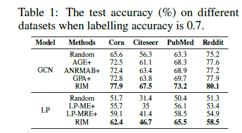
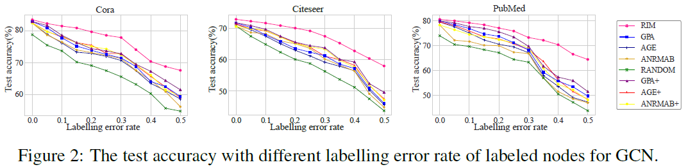
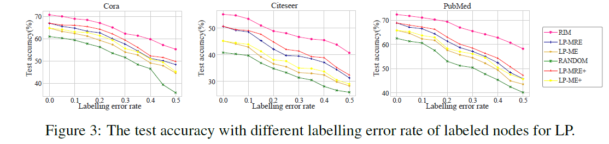
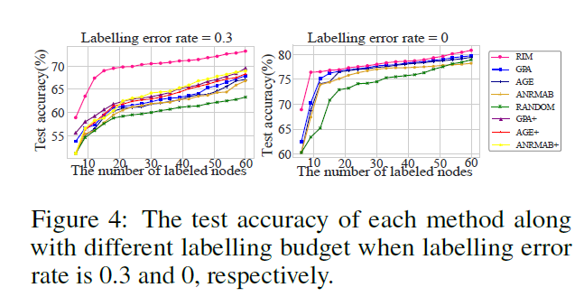
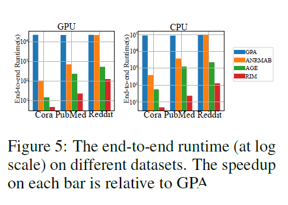
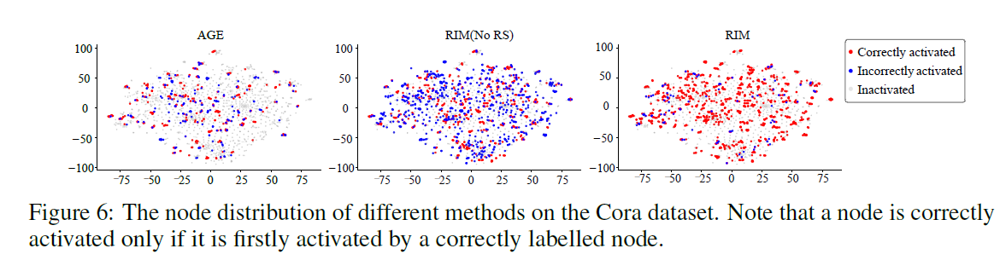

# RIM: Reliable Influence-based Active Learning on Graphs.

This repository is the official implementation of RIM. 

## Requirements

To install requirements:

```setup
pip install -r requirements.txt
```


## Training

To train the model(s) in the paper:


> cd the  “example” data

>run the python file RIM.py 


## Results

1. Accuracy comparison:



2. GCN performance comparison:



3. LP performance comparison:



4. Budget performance comparison:



5. Efficiency comparison:



6. Interpretability:


